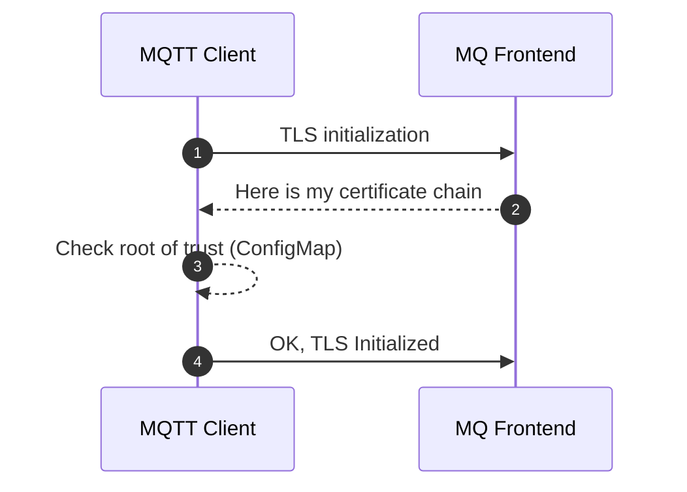

# Certificates, Roots CAs, Intermediate CA, Leaf Certificates, Trust, and TLS

Azure IoT Operations utilizes TLS for secure communication between servers and clients in services such as IoT MQ. This document aims to demystify the complex aspects of TLS, focusing on key elements like Root CA, Intermediate CA, Leaf Certificates, Certificate Chains, and Trust Bundles.

## Root Certificate Authority (Root CA)

In a production environment, the Root CA usually originates from an external Certificate Authority, which could be an Enterprise PKI or a third-party like VeriSign, GlobalSign, etc.

This document uses self-signed certificates as examples to explain the different flows of TLS exchanges. In the case of self-signed certificates, the Root CA is always at the top of the chain. It's the initial certificate and key pair used to sign any child certificates, which could be Intermediate CA certificates or Leaf certificates.

## Intermediate CA Certificates

Intermediate CAs are often used to establish different branches of chains. This allows for the renewal of only the Intermediate CA, while the Root CA can be trusted for longer periods.

The number of Intermediates used can vary. Some companies might use one Intermediate per division, project, or solution, while others might use just one. In a simple developer setup, one might decide not to use any intermediates and have the leaf certificates as children of the Root CA.

As a developer, it's always a good idea to setup a more realistic flow with at least one Intermediate since trust chain validations might behave differently in custom code or some custom libraries, and all scenarios should be tested.

## Leaf Certificate

The leaf certificate is the actual server or client certificate associated with a TLS server endpoint. In the case of Mutual TLS (mTLS) or certificate-based authentication, the certificate chain validation is done in the opposite direction, i.e., the server needs to verify the ownership of the client chain.

## Trust Distribution: Trust Bundles

When using public CAs from known vendors, these Root CAs are typically distributed with OS and are stored in the computer's trust store. However, when using private or self-signed CAs, a manual step is required to ensure all clients have an ability to load custom roots of trust.

In Kubernetes, *trust-manager* is a useful solution for distributing trust. It can distribute default CAs from known vendors as well as your own roots of trust. Read more about *trust-manager* [here](https://cert-manager.io/docs/trust/trust-manager/).

Regardless of whether you use *trust-manager* or not, you will typically end up distributing the Root CA distribution via a ConfigMap, which is then mounted onto Pods (applications) that require TLS connectivity to servers. These ConfigMaps, often referred to as Trust Bundles, may contain one or more root CAs.

## TLS Handshake Flow

A secure TLS channel between a client and a server is initiated with a handshake, which includes a Certificate validation flow. The server sends its full certificate chain to the client during the TLS handshake, which the client uses to verify the server's identity.

* The server sends its **full certificate chain** to the client during the TLS handshake.
* This chain typically includes:
  * The server's **end-entity certificate** (issued to the server's domain).
  * Intermediate certificates (if any) that link the server's certificate to a **trusted root certificate authority (CA)**.
  * The **root certificate** (optional but not recommended) that signed the intermediate certificate. Root trust is typically distributed upfront to client and therefore not recommended to include it in the Server Certificate Chain [see spec](https://www.rfc-editor.org/rfc/rfc5246#section-7.4.2).
* The client uses this information to verify the server's identity.

In IoT MQ, the configuration of TLS is done through `BrokerListener`. The flow will look like this:

## Trust Bundle and Certificate Renewal

Public Root CAs often have a very long expiry time, up to 25 years. In such cases, any number of Intermediate CAs and Leaf certificates might expire and renew, but the client needs no updating to the root of trust since this one has such a long validity timespan.

In Enterprise PKI or self-signed Root CAs this is often set to a much lower timespan since the whole chain is controlled end to end. This is why, it is often required to update Trust Bundles with new Root CAs and putting them in the same bundle. If a bundle contains the current Root CA all TLS communication will work. Then once a Root CA needs to be renewed, the Trust Bundle needs to be updated with the current as well as the new Root CA so the client is ready to verify a new chain once the server certificate is renewed. This rollover period needs to be carefully planned and clients need to be updated well upfront to any server certificate renewal.

## Trust Bundles and Trust Chains

A trust bundle can contain one or several root CAs that are used by a client to verify authenticity during a TLS handshake. When speaking about trust bundles and root of trust we are always and only speaking about the public certificate, never the private key.

In Kubernetes, this trust store is often configured through a `ConfigMap` that is mounted in the Pod. Because this information is always the public portion of a certificate, it is typically not stored in a Kubernetes `Secret`.

In addition to a collection of root CA certificates, the bundle can also contain a chain if required by some server and client setup where the root chain needs to be validated by the client. This is not a common setup but it is allowed. In that case the collection of certificates container both root as well as intermediate chains in the same bundle.

## Mutual TLS (mTLS)

In an mTLS flow, both the server and the client need to exchange their certificates and verify each other's authenticity. The process is initialized like any TLS flow, with the added step of the client sending its own chain, and this time it's the server validating the client. Each party (server and client) maintains its own root of trust (trusted CA certificates).

**Server Certificate Chain**:

* The server sends its **full certificate chain** to the client during the TLS handshake.
* This chain typically includes:
  * The server's **end-entity certificate** (issued to the server's domain).
  * Intermediate certificates (if any) that link the server's certificate to a **trusted root certificate authority (CA)**.
  * The **root certificate** (optional but not recommended) that signed the intermediate certificate. Root trust is typically distributed upfront to client and therefore not recommended to include it in the Server Certificate Chain [see spec](https://www.rfc-editor.org/rfc/rfc5246#section-7.4.2).
* The client uses this information to verify the server's identity.

**Client Certificate Chain**:

* The client sends its **full certificate chain** to the server during the TLS handshake.
  * This chain includes:
    * The client's **end-entity certificate** (issued to the client), also called *client certificate*.
    * Intermediate certificates (if any) that link the client's certificate to a trusted root CA.
      * The root certificate (optional but not recommended) that signed the intermediate certificate. The recommendation is for the server to have a trust store with the root of trust from the client. In MQ this is configured through `trustedClientCaCert` when using [X.509 Authentication](https://learn.microsoft.com/en-us/azure/iot-operations/manage-mqtt-connectivity/howto-configure-authentication#x509-client-certificate).
  * The server uses this information to verify the client's identity.

**Root of Trust**:

* Each party (server and client) maintains its own **root of trust** (trusted CA certificates).
* The server verifies the client's certificate using its trusted root CA.
* The client verifies the server's certificate using its trusted root CA.
* These trusted roots ensure that the certificates are valid and issued by a legitimate CA.
